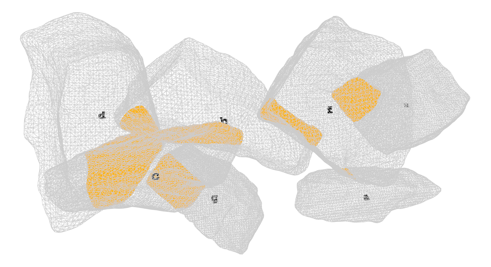
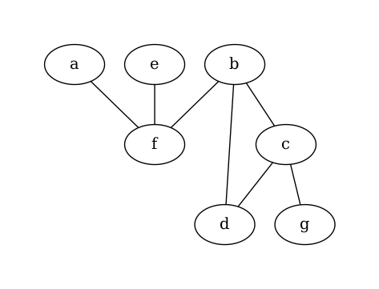

<h1 align="center">collide</h1>

<!-- <div align = "center">
    <a href="https://zenodo.org/badge/latestdoi/452384523">
        
    </a>
</div> -->

<p align="center">
    
</p>
<br/>

<div align = "center">
    <a>
        
    </a>
    <a>
        
    </a>
    <a>
        
    </a>
    <a>
        
    </a>
    <a>
        
    </a>
</div>

<br />

**collide** is a simple script to calculate and output data concerning the collision of a set of stones. It is developed in the frame of a collaboration between IBOIS lab (PI: [Andrea Settimi](andrea.settimi@epfl.ch)) and EESD lab (PI: [Savvas Saloustros](savvas.saloustros@epfl.ch)) at EPFL.

## Usage
First install conda and run the following command from the root of the repo:
```bash
conda env create -f environment.yml
conda activate collide
```
For running the script:
```bash
python './collide/src/main.py' --input_dir="./data/" --output_dir="./out/" --show_3d=0
```
with:
```bash
main.py
[--input_dir INPUT_DIR] = input directory (path)
[--output_dir OUTPUT_DIR] = output directory (path)
[--show_3d SHOW_3D] = show visualization (0 or 1)
[--print_ply_x PRINT_PLY_X] = save mesh of intersections (0 or 1)
[--print_analysis PRINT_ANALYSIS] = output .txt file with analysis (0 or 1)
[--print_graph PRINT_GRAPH] = output .pdf file with graph (0 or 1)
```


## Outputs
The script will generate `.txt` file with the following format and data:
```
Standard deviation of object stone pourcentage [%]: 0.45784513381761927
Intersected mesh total volume [m3]: 0.0032008825328167564
index_obj_a index_obj_b mesh_total_obj_pair_vol mesh_intersected_vol pourcentage_split_vol[%]
b f 0.043897394112773866 0.0004255081554947511 0.9693244077350162
c d 0.0385252926335249 0.0012272622917337075 3.185601478509569
...
```
A 3D interactive visualization of the scene.

<div align="center"></div>

The `.ply` files of the intersected mesh portions, as well as the graph intersection dependency.

<div align="center"></div>

## How to cite
```bibitex

```