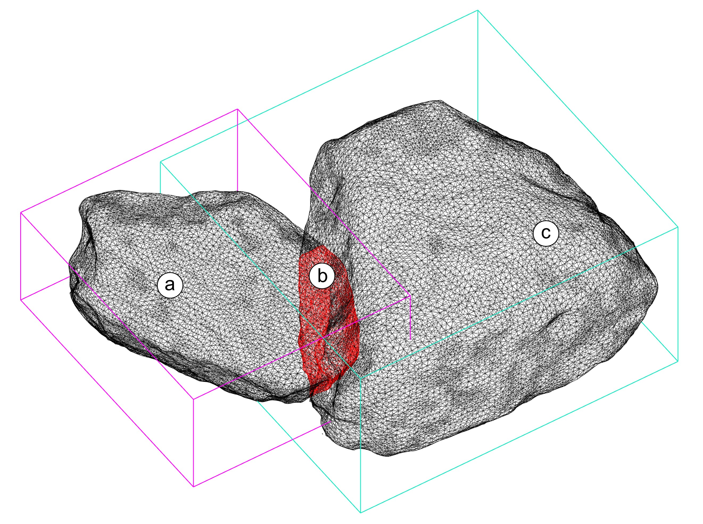

<h1 align="center">collide</h1>

<!-- <div align = "center">
    <a href="https://zenodo.org/badge/latestdoi/452384523">
        
    </a>
</div> -->

<p align="center">
    
</p>
<br/>

<div align = "center">
    <a>
        
    </a>
    <a>
        
    </a>
    <a>
        
    </a>
    <a>
        
    </a>
    <a>
        
    </a>
</div>

<br />

**collide** is a simple script to calculate and output data concerning the collision of a set of stones. It is developed in the frame of a collaboration between IBOIS lab (PI: [Andrea Settimi](andrea.settimi@epfl.ch)) and EESD lab (PI: [Savvas Saloustros](savvas.saloustros@epfl.ch)) at EPFL.

## Usage

## How to cite
```bibitex
to come
```